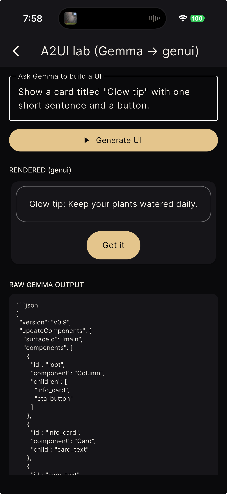

# genui_min

> **Generative UI on a phone — offline, from a 2-billion-parameter model.**

Most "AI builds your interface" demos quietly call GPT-4 in the cloud. `genui_min` does it with a small model running **entirely on-device**: the model emits [A2UI](https://a2ui.org), and Google's [`genui`](https://pub.dev/packages/genui) renders it into real, themed Flutter widgets. No server. No API key. No network.

✨ **Proven on Gemma 4 E2B, on an iPhone, in airplane mode.**

<p align="center">
  
</p>

> _"A card titled **Glow tip** with one short sentence and a button"_ → a real, branded Flutter card with a centered pill button — generated by a model running on the phone.

### Real on-device output

Generated **on an iPhone, offline**: Gemma emits A2UI, `genui_min` repairs it, and `genui` renders these themed cards. The big number is the optional `Stat` widget; the rest is `Text · Card · Button · Column`. In each screenshot the top box is the context fed to the model, and the card below is what `genui_min` rendered.

<p align="center">
  
  &nbsp;&nbsp;
  
</p>

> Same pipeline, two different prompts + data — each yields a structured, themed card with a metric, prose, and an action. No cloud, no API key.

See [`doc/proof.md`](doc/proof.md) for the tested device/model setup, prompt
budget notes, screenshots, and the small-model failure modes covered by tests.

---

## Why this isn't trivial

genui is excellent, but its full `BasicCatalog` (18 widgets) produces a **~19,000-token system prompt**. A 2–4B model on a phone can't fit that *and* leave room to answer. So on-device generative UI "doesn't work"… until you change two things:

| | full `BasicCatalog` | **`genui_min`** |
|---|---|---|
| widgets | 18 | 5 |
| system prompt | ~19,350 tokens | **~4,700 tokens** |
| fits a 2–4B model @ 8k ctx | ❌ | ✅ |

- 🪶 **A minimal, *styled* catalog** — `Text · Card · Button · Column · Stat` with polished, theme-aware renderers (centered pill button, padded rounded card, big-number metric). The prompt shrinks ~4×; the model can actually work.
- 🩹 **A deterministic repair pass** — small models reliably make a few A2UI mistakes (reusing a node, forgetting a button label, skipping `createSurface`). `genui_min` fixes them *before* rendering, so output is robust across prompts — not just the lucky one.

---

## Quick start

```dart
import 'package:genui/genui.dart';
import 'package:genui_min/genui_min.dart';

// 1. Build the catalog + system prompt.
final catalog = styledMinimalCatalog();
final systemPrompt = minimalSystemPrompt(catalog);

// 2. Generate with ANY on-device LLM (e.g. flutter_gemma). ~8k context.
final raw = await yourModel.generate(
  '$systemPrompt\n\nUser request: $userInput\n'
  'Respond with ONLY the A2UI messages described above.',
);

// 3. Repair the raw output (and inject createSurface if the model skipped it).
final clean = repairRawResponse(raw,
    surfaceId: 'main', catalogId: catalog.catalogId!);

// 4. Feed `clean` to a FRESH genui transport each turn, then render with
//    genui's `Surface` widget. (See gotcha #1.)
```

Full working app in [`example/`](example/) — three interchangeable backends
(on-device Gemma via `flutter_gemma`, a local Ollama server, and a
zero-setup "sample output" mode that renders a canned response with a
deliberate small-model bug), plus a visible repair log after every render.

```bash
cd example && flutter pub get
flutter run --dart-define=HF_TOKEN=hf_xxx   # on-device Gemma
flutter run                                  # or just tap "Use sample output"
```

For a tighter runtime integration checklist, see
[`doc/flutter_gemma.md`](doc/flutter_gemma.md).

---

## How it works

### The catalog is the prompt-size dial
genui builds the system prompt from the JSON schema of **every** widget in the catalog. Fewer widgets → a dramatically smaller prompt. A handful of components (`Text · Card · Button · Column · Stat`) cover most "card + actions" UIs. `styledMinimalCatalog()` keeps the same A2UI component names and schemas as the basic catalog — so the prompt format is standard — but ships **custom renderers** so the result looks good out of the box.

### The repair pass makes small models safe
`repairUpdateComponents()` (pure Dart, unit-tested) turns rough model output into a clean, renderable tree:

- **Reused child references** (the classic "Button reuses the Card's Text") → the shared subtree is deep-cloned so it's a real tree.
- **Missing / dangling child refs** → dropped; a `Button` with no label gets a synthesized `Text`.
- **Missing `root`** → the unreferenced top-level node is promoted (or all roots wrapped in a `Column`).
- **Invented `surfaceId`** → the model renames the surface (e.g. `week_summary`), so the update targets a surface that was never created and nothing mounts; every update is pinned back to the surface that *was* created.
- **Required props** → `Text` without `text` gets `""`, `Button` without `action` gets a no-op event.
- Orphans (unreachable from `root`) are dropped.

Pass a `RepairLog` and you get back exactly **which** repairs fired (`tree:clonedReusedChild×2, …`) — per-response telemetry that also powers the bench.

### The bench: a corpus + scorer for small-model A2UI
`dart run tool/bench.dart` scores a corpus of raw model outputs (`bench/cases/`) — *"would it render?"* plus the per-rule repair fingerprint — so models can be compared and repair regressions can't land silently. Contributing a captured output from *your* model is the easiest meaningful PR. See [`doc/bench.md`](doc/bench.md).

### Constrained decoding: invalid A2UI, prevented at the source
`updateComponentsOutputSchema(catalog)` derives a JSON Schema from the same catalog that builds the prompt — hand it to Ollama's structured outputs (`OllamaRunner` + `responseFormat`) and the model *cannot* emit invalid A2UI. `updateComponentsGbnf(catalog)` does the same for llama.cpp-family samplers. Verified live: qwen3:4b unconstrained produced undecodable JSON; with the schema, a perfect tree and zero repairs. See [`doc/constrained.md`](doc/constrained.md).

### Bring any runner
The pipeline needs any source of text: `LlmRunner` is the one-method contract. On-device via `flutter_gemma` (see the example app's ~15-line adapter), or over a local `ollama serve` via `OllamaRunner` (`package:genui_min/ollama.dart`) — the laptop path with no phone required.

### The gallery: see the catalog
`gallery/` is a web-buildable component gallery — every catalog widget rendered through the real pipeline with its props, variants, and A2UI JSON, plus a live playground where you can paste or break A2UI and watch the repair log fix it (no model needed).

```bash
cd gallery && flutter pub get && flutter run    # or: flutter build web
```

### Three gotchas (learned the hard way)
1. **Rebuild the genui transport every turn.** `A2uiTransportAdapter.flush()` permanently *closes* its input stream — reuse throws `Bad state: Cannot add event after closing`. Make a fresh `SurfaceController` + `A2uiTransportAdapter` + `Conversation` per generation.
2. **The app creates the surface; the model just fills it.** Small models reliably emit `updateComponents` but skip the `createSurface` bootstrap — `repairRawResponse` injects it for you.
3. **Pick the model for memory, not just quality.** A bigger context = a bigger KV cache. On an 8 GB iPhone, **Gemma 4 E2B (2.6 GB)** runs comfortably at 8k context; **E4B (3.7 GB)** OOMs during KV-cache allocation. The smaller model is the headroom the larger context needs.

---

## Install

```yaml
dependencies:
  genui_min: ^0.2.0
  genui: ^0.9.0
```

`genui_min` is renderer-only — **bring your own on-device LLM** (e.g. [`flutter_gemma`](https://pub.dev/packages/flutter_gemma)). On iOS, large-model inference needs the `com.apple.developer.kernel.increased-memory-limit` entitlement (a paid Apple Developer account).

## Acknowledgements

Built on [`genui`](https://pub.dev/packages/genui) (© The Flutter Authors, BSD-3-Clause) and the [A2UI](https://a2ui.org) protocol. MIT licensed.
