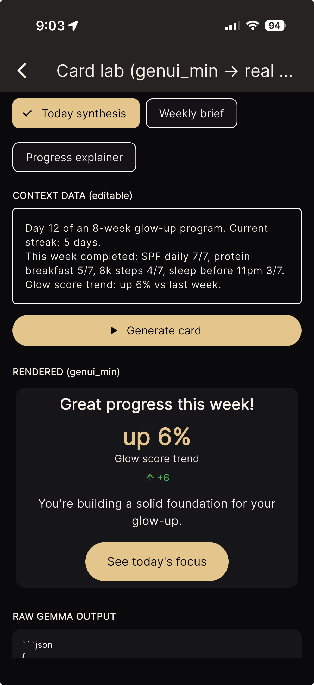
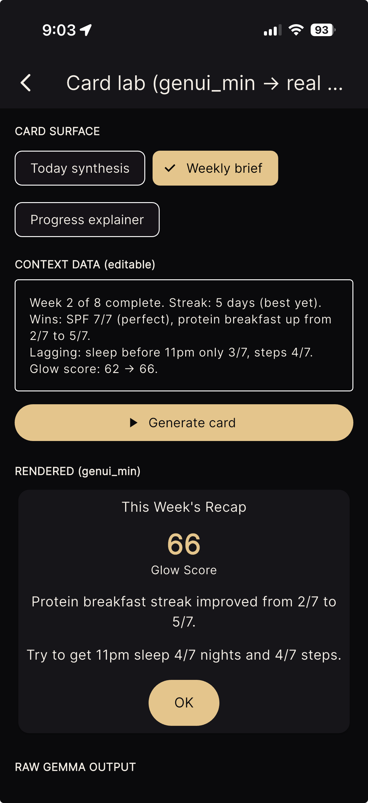

# On-Device Proof Notes

`genui_min` is designed for the constrained version of generative UI: a small
model running on a phone, no server, no API key, and no network after model
download.

## Tested Setup

- Device: iPhone
- Runtime: Flutter app using `flutter_gemma`
- Model: Gemma 3n E2B IT LiteRT preview `.task`
- Context: 8k tokens
- Connectivity: airplane mode during generation
- Renderer: Google's `genui` package rendering A2UI into themed Flutter widgets

## Prompt Budget

| Catalog | Components | Approximate system prompt |
| --- | ---: | ---: |
| genui `BasicCatalog` | 18 | ~19,350 tokens |
| `genui_min` styled catalog | 5 | ~4,700 tokens |

The smaller catalog leaves room for the model's answer inside an 8k context
window. That was the difference between "the model can see the protocol" and
"the model can see the protocol and still answer."

## Captured Outputs

The screenshots below were generated on-device. The top of each screen shows the
context sent to the model; the rendered card below is built from the repaired
A2UI response.

## What The Repair Pass Caught

Small local models were good enough to choose the right structure, but they
regularly made a handful of repeatable A2UI mistakes:

- skipped the initial `createSurface` message
- reused the same child component under multiple parents
- emitted a `Button` with no label child
- targeted an invented `surfaceId`
- left dangling child references
- dropped commas or a closing brace in otherwise recoverable JSON

The package keeps these cases deterministic and testable. See
[`test/fixtures`](../test/fixtures/) for small raw examples and
[`test/a2ui_repair_test.dart`](../test/a2ui_repair_test.dart) for regression
coverage.
